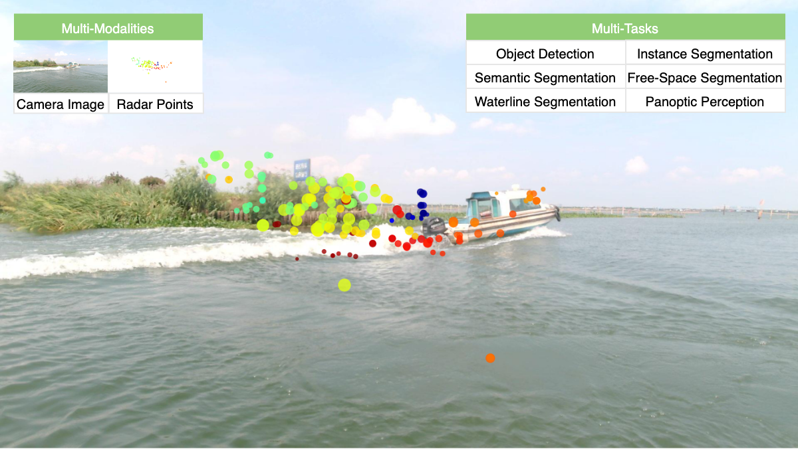
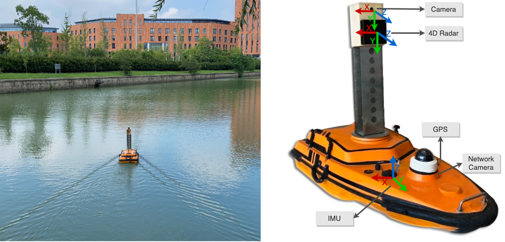

#  
A Multi-Task 4D Radar-Camera Fusion Dataset for Autonomous Driving on Water Surfaces

Website: [https://waterscenes.github.io](https://waterscenes.github.io)

arXiv: [https://arxiv.org/abs/2307.06505](https://arxiv.org/abs/2307.06505)

 

## Overview
- [Changelog](#changelog)
- [Dataset](#dataset)
- [Devkit](#devkit)
- [Acknowledgement](#acknowledgement)
- [Citation](#citation)

## Changelog
- July 13, 2023: Website and Devkit released.
- July 21, 2023: Sample dataset released.
- Dataset will be public soon.

## Dataset
### Introduction

 

* WaterScenes, the first **multi-task 4D radar-camera fusion dataset** on water surfaces, which offers data from multiple sensors, including a 4D radar, monocular camera, GPS, and IMU. It can be applied in multiple tasks, such as **object detection**, **instance segmentation**, **semantic segmentation**, **free-space segmentation**, and **waterline** segmentation.
* Our dataset covers diverse **time conditions** (daytime, nightfall, night), **lighting conditions** (normal, dim, strong), **weather conditions** (sunny, overcast, rainy, snowy) and **waterway conditions** (river, lake, canal, moat). An information list is also offered for retrieving specific data for experiments under different conditions.
* We provide **2D box-level** and **pixel-level** annotations for camera images, and **3D point-level** annotations for radar point clouds. We also offer precise timestamps for the synchronization of different sensors, as well as intrinsic and extrinsic parameters.
* We provide a toolkit for radar point clouds that includes: **pre-processing**, **labeling**, **projection** and **visualization**, assisting researchers in processing and analyzing our dataset.

Sample dataset: [https://drive.google.com/uc?id=1j6BxP6tpaenYl8ADa9v-kC0I_jWob4Ji&export=download](https://drive.google.com/uc?id=1j6BxP6tpaenYl8ADa9v-kC0I_jWob4Ji&export=download)

### USV Setup
 

### Dataset Statistics
The dataset includes 54,120 sets of RGB images, radar point clouds, GPS and IMU data, covering over 200,000 objects.

<table>
<thead>
  <tr>
    <th>Tasks</th>
    <th colspan="8">Object Detection / Instance Segmentation / Semantic Segmentation</th>
    <th>Free-Space Segmentation</th>
    <th>Waterline Segmentation</th>
    <th colspan="2">Adverse Conditions</th>
  </tr>
</thead>
<tbody>
  <tr>
    <td>Classes</td>
    <td>Total</td>
    <td>Pier</td>
    <td>Buoy</td>
    <td>Sailor</td>
    <td>Ship</td>
    <td>Boat</td>
    <td>Vessel</td>
    <td>Kayak</td>
    <td>Free-Space</td>
    <td>Waterline</td>
    <td>Lighting</td>
    <td>Weather</td>
  </tr>
  <tr>
    <td>Frames</td>
    <td>54,120</td>
    <td>25,787</td>
    <td>3,769</td>
    <td>3,613</td>
    <td>19,776</td>
    <td>9,106</td>
    <td>9,362</td>
    <td>366</td>
    <td>54,057</td>
    <td>53,926</td>
    <td>5,604</td>
    <td>10,729</td>
  </tr>
  <tr>
    <td>Objects</td>
    <td>202,807</td>
    <td>121,827 (60.07%)</td>
    <td>16,538 (8.15%)</td>
    <td>8,036 (3.96%)</td>
    <td>34,121 (16.82%)</td>
    <td>10,819 (5.33%)</td>
    <td>11,092 (5.47%)</td>
    <td>374 (0.18%)</td>
    <td>54,057</td>
    <td>159,901</td>
    <td>30,517 (15.05%)</td>
    <td>46,784 (23.07%)</td>
  </tr>
</tbody>
</table>

### Dataset Structure

```
WaterScenes (root)
  - image # RGB images
    - 000001.jpg
  - radar # radar files
    - 000001.csv
  - radar_3_frames # 3 frames before and after current timestamp
    - 000001.csv
  - radar_5_frames # 5 frames before and after current timestamp
    - 000001.csv
  - calib # intrisic and extrisic parameters
    - 000001.txt
  - gps # gps file
    - 000001.csv
  - imu # imu file
    - 000001.csv
  - detection # annotation files for object detection task
    - yolo 
      - 000001.txt
  - instance # annotation files for instance segmentation task
    - yolo 
      - 000001.txt
    - labelme 
      - 000001.json
  - semantic # annotation files for semantic segmentation task
    - SegmentationClass 
      - 000001.txt
    - label_mapping.txt
  - free_space # annotation files for free-space segmentation task
    - SegmentationClass 
      - 000001.txt
    - label_mapping.txt
  - waterline # annotation files for waterline segmentation task
    - SegmentationClass 
      - 000001.txt
    - label_mapping.txt

```

### Labels
| Code | Label      | Note                                               |
|------|------------|----------------------------------------------------|
| -1   | no-object  | No object. Only for radar point clouds             |
| 0    | pier       | Static object                                      |
| 1    | buoy       | Static object                                      |
| 2    | sailor     | Person on the surface vehicles                     |
| 3    | ship       |                                                    |
| 4    | boat       |                                                    |
| 5    | vessel     |                                                    |
| 6    | kayak      |                                                    |
| -    | free-space | Only for instance/semantic/free-space segmentation |
| -    | waterline  | Only for waterline segmentation                    |

### Radar Format
Radar point clouds are stored in csv files.

We provide radar point clouds in three flavors:
* radar (single frame of the current timestamp)
* radar_3_frames (accumulation of the last 3 radar frames)
* radar_5_frames (accumulation of the last 5 radar frames)

Each csv file contains a set of points in a specific timestamp:
| Column        | Description                                                     |
|---------------|-----------------------------------------------------------------|
| timestamp     | timestamp of the point                                          |
| range         | radial distance to the detection (in m)                         |
| doppler       | radial velocity measured for this point (in m/s)                |
| azimuth       | azimuth angle to the detection (in degree)                      |
| elevation     | elevation angle to the detection (in degree)                    |
| power         | reflected power value of the detection (in dB)                  |
| x             | x value in the XYZ coordinates                                  |
| y             | y value in the XYZ coordinates                                  |
| z             | z value in the XYZ coordinates                                  |
| comp_height   | absolute height of the point (in m)                             |
| comp_velocity | absolute velocity of the point (in m/s)                         |
| u             | x-axis on the image plane                                       |
| v             | y-axis on the image plane                                       |
| label         | semantic class id of the object （Refer to [Labels](#labels)）   |
| instance      | instance id of the object to which this detection belongs       |

### GPS Format

| Column                  | Description                            |
|-------------------------|----------------------------------------|
| timestamp               | current timestamp                      |
| latitude                | latitude                               |
| longitude               | longitude                              |
| number_of_satellites    | number of satellites                   |
| altitude                | altitude                               |
| true_north_heading      | true north heading to the earth        |
| magnetic_north_heading  | magnetic north heading to the earth    |
| ground_speed_kn         | speed (in kn)                          |
| ground_speed_kph        | speed (in km/h)                        |

### IMU Format

| Column                | Description                            |
|-----------------------|----------------------------------------|
| timestamp             | current timestamp                      |
| pitch                 | pitch (x-axis, right)                  |
| roll                  | roll (y-axis, front)                   |
| yaw                   | yaw (z-axis, top)                      |
| angular_velocity_x    | angular velocity in x-axis             |
| angular_velocity_y    | angular velocity in y-axis             |
| angular_velocity_z    | angular velocity in z-axis             |
| linear_velocity_x     | linear velocity in x-axis              |
| linear_velocity_y     | linear velocity in y-axis              |
| linear_velocity_z     | linear velocity in z-axis              |
| magnetic_field_x      | magnetic field strength in x-axis      |
| magnetic_field_y      | magnetic field strength in y-axis      |
| magnetic_field_z      | magnetic field strength in z-axis      |

## Devkit
### Installation

Requirements
* Linux (tested on Ubuntu 18.04/20.04)
* Python 3.6+

1. Clone the repository: `https://github.com/WaterScenes/WaterScenes.git`

2. Inside the root folder, use the environment.yml to create a new conda environment using: `conda env create -f environment.yml`

3. Activate the environment using: `conda activate waterscenes`

4. In the same terminal windows typing `jupyter notebook` will start the notebook server.

In case the interactive plots do not show up in the notebooks use: jupyter nbextension install --py --sys-prefix k3d

### Example
After fetching both the data and the devkit, please refer to these manuals for several examples of how to use them, including data loading, fetching and applying transformations, and 2D/3D visualization: [Tutorial.ipynb](https://github.com/WaterScenes/WaterScenes/blob/main/Tutorial.ipynb)


## Acknowledgement
* We referred to the [nuScenes](https://github.com/nutonomy/nuscenes-devkit), [RadarScenes](https://github.com/oleschum/radar_scenes) and [View of Delft](https://github.com/tudelft-iv/view-of-delft-dataset) datasets, and are grateful to their websites and github repositories.

## Citation
Please use the following citation when referencing
```
@misc{yao2023waterscenes,
      title={WaterScenes: A Multi-Task 4D Radar-Camera Fusion Dataset and Benchmark for Autonomous Driving on Water Surfaces}, 
      author={Shanliang Yao and Runwei Guan and Zhaodong Wu and Yi Ni and Zixian Zhang and Zile Huang and Xiaohui Zhu and Yutao Yue and Yong Yue and Hyungjoon Seo and Ka Lok Man},
      year={2023},
      eprint={2307.06505},
      archivePrefix={arXiv},
      primaryClass={cs.CV}
}
```

